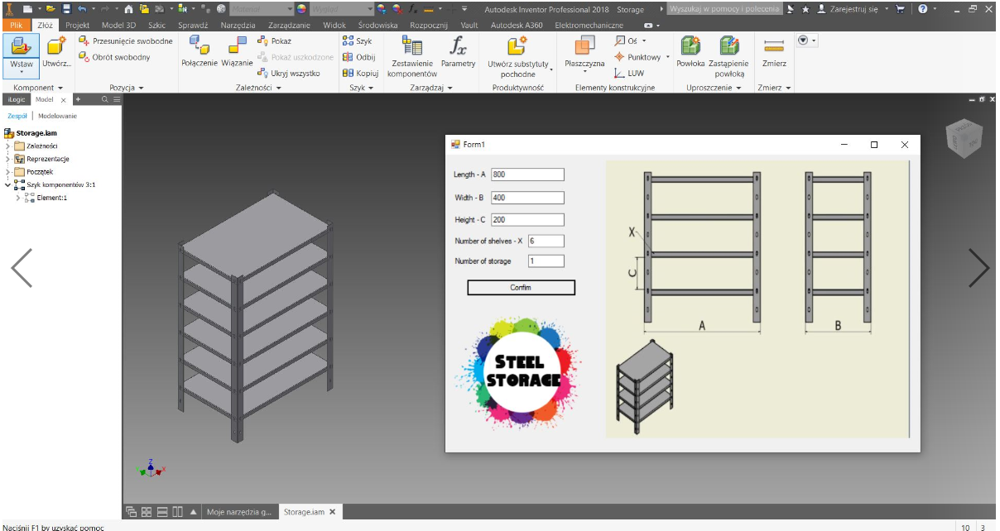

# SteelStorageInventorAPIVBA

> Video available here https://youtu.be/gQFmVYoAR-Q

## Table of contents
* [General info](#general-info)
* [Screenshots](#screenshots)
* [Technologies](#technologies)
* [Contact](#contact)

## General info
The application allows you to change the dimensions of shelves created in Autodesk Inventor.

## Screenshots

## Technologies
- VBA.net - Windows Forms 
- Visual studio Code 2019

## Contact
Created by lukasz.neumann90@gmail.com - feel free to contact me!
